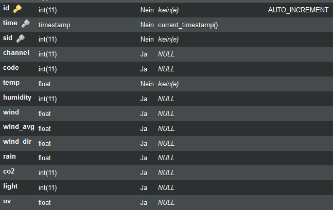
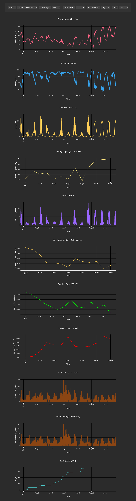

# This repo implements a weather dashboard written in PHP for my personal use. However, maybe someone may find the code useful.

Most of the code was generated by ChatGPT.

## Requirements:

PHP, MysQL for the Backend  
And an HTTP server with PHP and MySQL support for the Frontend

# Descriptions of the modules:

## Backend:

* `weather-srv.php`: Server for weather station clients. This module writes weather station data once per minute into the MySQL database.
* `sdr-client.php`: Reads rtl_433 output and forwards it to the afformentioned server.
* `co2mon-client.php`: Reads co2mon_c output and forwards it to the server. => https://github.com/tpoechtrager/co2mon_c/

## Frontend:

* `weather.php`: Weather station dashboard  
* `weather-api.php`: API implementation for the dashboard  
* `weather-stations.json`: A list of weather stations that should be shown in the Dashboard

## Configuration:

* Update the connection data in the server and client scripts.
* Weather stations must be added to added to

```php
    $weatherStationTypes = [
        "Bresser-7in1" => 0,
        "Bresser-5in1" => 1,
        "LaCrosse-TX35DTHIT" => 2,
        "LaCrosse-TX141THBv2" => 5,
        "TFA-Dostmann-AIRCO2NTROL-MINI" => -24
    ];
```

in `weather-srv.php` and to `www/weather-stations.json`. The right number is the `sid` (station id). You can choose these number freely to identify your weather stations.

## MySQL Database layout:



## Dashboard:


